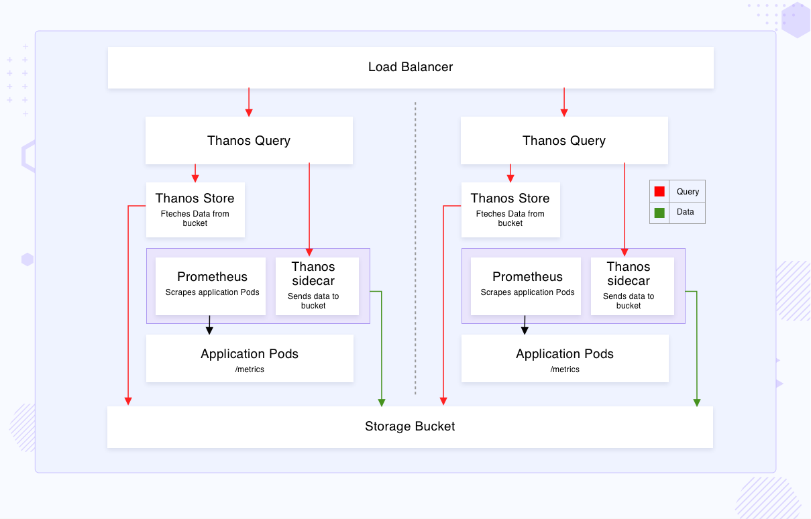

# Guide to Up stack

- ##### create client.pem key: the key has public key located in the server.

- ##### prerequisite:
> export VAULT_PASSWORD=my_vault_password

> chmod +x .vault_pass.py

- ##### provision observer 
> ansible-playbook provision.yaml -i inventory -t observer --vault-password-file .vault_pass.py

- ##### provision telegraf slave
> ansible-playbook provision.yaml -i inventory -t slave_servers

- ##### provision all:
> ansible-playbook provision.yaml -i inventory  --vault-password-file .vault_pass.py

<hr/>

# Thanos-io for High availability and Reliability of Data (HA Prometheus)


## Cluster01:

#### prometheus01
```
the prometheus1 container handle collect metrics from exporter, push gateway...
```

#### thanos-sidecar01
```
thanos-sidecar01 container is responsible for pushing data to object storage (s3, minio...) and response data to Thanos Query
```

## Cluster02:

#### prometheus02
```
the prometheus02 container handle collect metrics from exporter, push gateway...
```

#### thanos-sidecar02
```
thanos-sidecar02 container is responsible for pushing data to object storage (s3, minio...) and response data to Thanos Query
```

## Thanos Cluster:

#### Thanos-querier:
```
Thanos-querier: container is responsible for query data from thanos-sidecar and thanos-store-gateway(thanos store)
```

#### Thanos Store Gateway:

```
- Thanos Store Gateway work as an API Gateway between your Thanos cluster and the Object store (s3, minio, GCS, ...)

- Thanos Store Gateway: that require access to your Object storage (s3, minio, GCS, ...)

- Thanos Store Gateway: It keeps a small amount of information about all remote blocks on the local disk and keeps it in sync with the bucket
```

#### Thanos-compactor:

```
- Compacts, down samples and applies retention on the data stored in cloud storage bucket.
```

#### Thanos-ruler:

```
- Evaluates recording and alerting rules against data in Thanos for exposition and/or upload.

- Participates in the system as a store node, which means that it exposes StoreAPI and uploads its generated TSDB blocks to an object store
```
